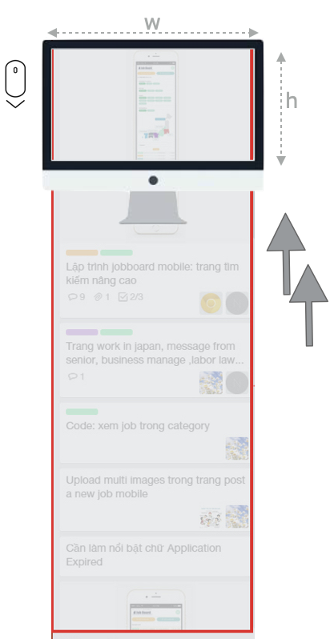
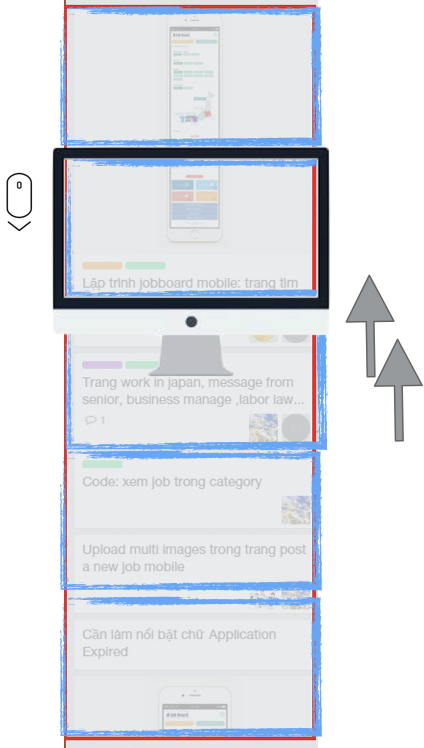
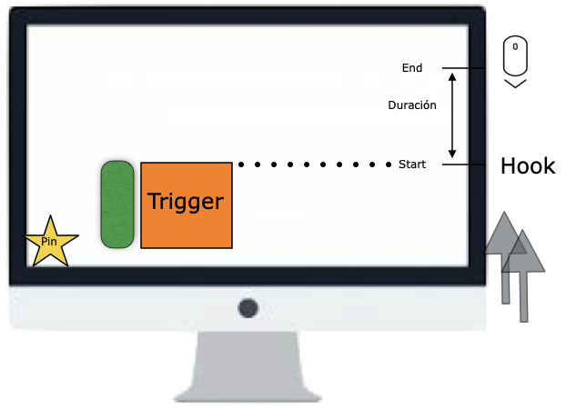
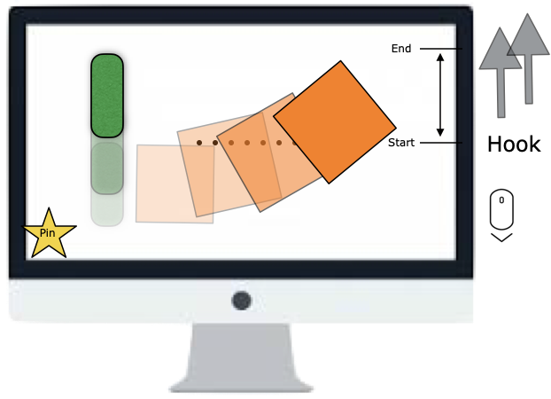

#Creación de narrativas digitales mediante Scrollytelling 

### Miguel Gea Megías, Universidad de Granada

> (Versión 1.0 Creative Commons, Agosto 2022,  )
>
> Gea, M. (2022) Creación de narrativas digitales mediante Scrollytelling, Artículo Creative Commons CCBYNCSA, update 15/08/2022 online https://github.com/mgea/CCpapers


 

## 1 Introducción al storytelling digital

> Remediation is essentially the appropriation of the content of one medium into another. The electric light is pure information. It is a medium without a message, as it were, unless it is used to spell out some verbal ad or name. This fact, characteristic of all media, means that the “content” of any medium is always another medium
>
> *Medium is the message, 1964* - *Marshall McLuhan*


El año 2013 ha sido destacado por el *NYTimes como el año del storytelling interactivo* (www.nytimes.com/newsgraphics/2013/12/30/year-in-interactive-storytelling/ Cada vez se publican más contenidos donde se propone una participación activa del lector, ya sea para las noticias de un periódico, para la creación de libros o para la narración audiovisual. Su uso empieza a ser fundamental para creación de historias narradas en formato multimedia, visualización de datos, etc. 

Storytelling es el **arte de contar una historia**. La creación y aprovechamiento de una atmósfera mágica a través del relato. Técnica que consiste en conectar con tus usuarios, ya sea a viva voz, por escrito, o a través de una historia con su personaje y su trama (Millner, 2020)

Las características de una narración interactiva (Millner, 2020)

*  Es una  **experiencia participativa**: la narración requiere intervención del usuario/espectador. Modalidades 
  * **Navegación**/extractiva: hipertextual, órdenes, toma de decisiones
  *  **Inmersiva**: Entorno con apariencia y acciones intrínsecas (Ryan 2001)

* Es una **narración no lineal,** ya que el usuario puede tomar la iniciativa.
* Hace falta usar un motor de narrativa (**storytelling engine**) Se requiere de un entorno donde sucede la narración y facilita las acciones (hablar, moverse, etc.) 
* Se necesita una *historia* (**story**). Personajes, narración, trama… Similar a una novela/film.


**Bibliografía**

* Carolyn H. Miller (2020) **Digital Storytelling: A Creator's Guide to Interactive Storytelling, 4th edition** CRC Press, Taylor & Francis, https://www.carolynmiller.com 
* P. C. Herbert Roth (2015) Experiencing Interactive Storytelling. PHD, Vrije Universiteit Amsterdam. https://research.vu.nl/ws/portalfiles/portal/1589776


## 2 Términos y estrategias para storytelling 

Cada vez es más importante la información visual en Internet. Algunos de los conceptos relacionados con storyelling digital son los siguientes: 


* **Visual Storytelling** es el uso de imágenes, video, infografía, presentaciones y otros elementos visuales para desarrollar una historia, y captar la atención sobre el contenido (Pettersen, 2019). Visual storytelling tells stories using visual representations 

* **Parallax** (el paralaje) es una técnica de diseño web que crea la ilusión de profundidad de una página web. El contenido se organiza en capas (layer) que se van solapando mediante la simulación de la técnica de [cámara multiplano](https://en.wikipedia.org/wiki/Multiplane_camera) que se usaba en la [animación tradicional](https://en.wikipedia.org/wiki/Traditional_animation) desde 1930 y que popularizó Walt Disney.

* **Scrolling** es el efecto de desplazarse por el contenido de la página web (que es de un tamaño mayor al área del display) usando el mouse. Esta acción (evento) se puede utilizar como disparador (trigger) de los cambios que se producen en la página web, y que pueden ser diferentes en cada uno de los planos (layer) que la componen. El uso de scrolling se convierte en una técnica muy potente para data-driven storytelling (Pettersen, 2019)

* El efecto **Parallax scrolling** se popularizó con [gráficos 2D](https://en.wikipedia.org/wiki/2D_computer_graphics) y en los [videojuegos](https://en.wikipedia.org/wiki/Video_game) basados en el modelo de [arcade games](https://en.wikipedia.org/wiki/Arcade_games) y las imágenes de fondo se mueven más lentas que las de frente, creando un efecto de animación con profundidad  

  

* Se denomina **Scrollytelling** a la técnica de visualización de contenidos dependiendo del movimiento, que proviene de combinar *scroll* («desplazamiento») con *storytelling* («contar historias») (Goldenberg, 2017), es decir: *Websites that Tell a Story As You Scroll*    

  


## 3 Storytelling y periodismo digital


>  ¿Por qué me empeño en ir a comprar el periódico cada mañana si puedo recibir una información mucho más completa directamente en la pantalla de mi ordenador? Lo que pueda ser digital, lo será
>
> *Being Digital 1994, Nicholas Negroponte,* 


Con la expansión de la cultura digital se produce un fenómeno de crisis crónica y  falta de  identidad de la prensa escrita. El siglo XX fue testigo de la eclosión de nuevos medios que plantean una competencia muy importante como radio y, posteriormente la televisión, pero que sin embargo fueron capaces de convivir de forma natural. Sin embargo, la situación en este siglo XXI con un mundo hiperconectado a Internet ha provocado transformaciones tecnológicas que han afectado al modo en que se produce, difunde y consume información (Pedriza, 2019)

En ese proceso de búsqueda de un hueco en este nuevo contexto digital se ha sucedido diferentes estrategias para la distribución (periódicos digitales gratuitos, contenidos por subscripción) y  en el modo de redacción y creación de contenidos, potenciando las redes sociales, la participación del usuario y fomentando estrategias de consumo fácil orientadas a captar audiencia mediante la llamada de atención con clicbaits (Palau-Sampio, 2016)

Dentro de este panorama (donde se potencia el consumo rápido), surge otra estrategia basada en artículos con un contenido mucho más profundo, de largo formato y basado en un lenguaje rico en multimedia. Uno de los reportajes con estas características es "Snow Fall: Avalanche at Tunnel Creek"  del primer artículo multimedia del New York Times sobre la avalancha de Tunnel Creek de 2012, publicado el 20 de diciembre de 2012 (https://www.nytimes.com/projects/2012/snow-fall/). Existía por entonces la creencia que *nadie sería capaz de leer artículos largos en línea, y que se necesitaba imprimirlos para mantener la concentración de lectura* (Dowling, 2019). 

Este *modelo de periodismo de formato largo* (**long-form journalism**) se caracteriza por rodear al usuario en un campo visual de insmersión no destructivo (inmersión sensorial), de modo que se pueda concentrar en la historia mediante la narración de una historia (storytelling) usando los recursos multimedia adaptados a las características y tamaño de la publicación electrónica  (Dowling, 2019).

Una variante de este modelo de storytelling es ell denominado **scrollytellling**,  de modo  ue usa el scolling para hacer avanzar la historia. El scrollytelling transforma una historia de formato largo (long-form journalism) en una experiencia interactiva (Cardello, 2019). 

Esta técnica de desplazamiento (scrolling) se puede combinar con otras para dotar a la historia de una sensación inmersiva. En este sentido, el efecto de profundidad y linearidad que proporciona el efecto **parallax** es perfecto para sumergir al usuario en la historia con una experiencia comunicativa mucho más divertida y cercana a otros medios como el videojuego o el cómic.   

Tanto el **NYT** (https://www.nytimes.com/section/magazine) como el **WSJ** (visual stories https://www.wsj.com/story) ha sido los periódico pioneros en introducir este tipo de artículos de formato largo. Además, hay revistas especializadas como [The Atavist](https://magazine.atavist.com/) que se especializa en crear un  repertorio de publicaciones de formato largo (Carr, 2011). Posteriormente aparece otras como [Longform](https://longform.org/) o  [Longread](https://longreads.com/)  que son como magazines especiallizados en este tipo de articulo de formato largo. 

Sin embargo, es la revista **ThePudding** (https://pudding.cool/) (fundada en 2017 por Russell Goldenberg) es la que se especializa en el fenómeno de  "data journalism" para contar historias mientras se hace scroll en la página. Aloja artículos denominados ensayos visuales, un proyecto para para darle vida a la información de forma elegante y visual. 


#### Proyectos más destacados

- New York Times (2012) **Snow Fall: Avalanche at Tunnel Creek** (John Branch)  publicado el 20 de diciembre de 2012. Disponible en:  https://www.nytimes.com/projects/2012/snow-fall/

  Snow Fall is a scrollytelling masterpiece. It’s the harrowing tale of a Washington avalanche in 2012. Each part of this story has its own individual page, broken into manageable blocks (Cardello, 2019)

- SBS (2015) **The boat** https://www.sbs.com.au/theboat/ 

  Diseñador: Matt Huynh https://www.matthuynh.com/theboat 

  SBS’s 2015 interactive graphic novel ‘The Boat‘, an adaption of Nam Le’s widely acclaimed anthology released, shares the experience of a young refugee girl escaping the perils of the Vietnamese war. The production movingly exemplifies the innovative nature of interactive journalism, through it’s emotional effectiveness and the truly immersive power created by parallax scrolling (Fadel & Bizzocchi, 2021)  

- WSJ (2015) **Cocainenomics** https://www.wsj.com/ad/cocainenomics-es 
  The Wall Street journal lanza “Cocainenomics” un reportaje publicitario para la serie "Narcos" de Netflix (Pettersen 2019)

- PitchFork (2016) **Glitter in the Dark, 2016** Revista de Chicago online sobre música independiente. Glitter in the dark Entrevista a Bat for Lashes. http://pitchfork.com/features/cover-story/reader/bat-for-lashes/ 

- National Geographic: (2019) **Susan Potter Will Live Forever**, 2019 Excellence and Innovation en Visual Digital Storytelling HTML5, premio OJA (Online Journalism Awards): https://awards.journalists.org/entries/susan-potter-will-live-forever/, 

  Website: https://www.nationalgeographic.com/magazine/graphics/visible-human-susan-potter-cadaver

  

#### **Magacines long-form**

* **ThePudding** (https://pudding.cool/) 
* **New York Times** (https://www.nytimes.com/section/magazine) 
* **Wall Srteet Journal** (visual stories https://www.wsj.com/story)
* **The Atavist** (https://magazine.atavist.com/)


#### **Bibliografía**

* Pedriza, Samia Benaissa (2019) *Medios impresos versus digitales: de la agónica lectura de periódicos a los nuevos consumos de información digital*, *El Argonauta español* online 16,  30 sept 2019 Disponible en: http://journals.openedition.org/argonauta/3855 ; DOI : https://doi.org/10.4000/argonauta.3855

* Evoca, comunicación e imagen (2009). La revolución de la prensa digital. Consultado desde http://www.evocaimagen.com/cuadernos/cuadernos1.pdf

* Palau-Sampio, D. (2016) Metamorfosis de la prensa de  referencia en el contexto digital: 

  clickbait y estrategias de tabloide en Elpais.com. Communication &  Society 29(2), 63-80. ONline https://www.researchgate.net/publication/301304747_Metamorfosis_de_la_prensa_de_referencia_en_el_contexto_digital_clickbait_y_estrategias_de_tabloide_en_Elpaiscom

* Dowling, David (2019) *Inmersive Longform Storytelling, media, technology, audience*. Routledge Taylor & Francis.

* Carr, D (2011) Long-Form Journalism Finds a Home, NYT 27/03/2011. https://www.nytimes.com/2011/03/28/business/media/28carr.html

* Cardello, J. (2019) **A beginner's guide to scrollytelling**. Webflow, https://webflow.com/blog/scrollytelling-guide 

* Fadel,L. M. ;  Bizzocchi, Jim  (2021) **Narrative Infusion in Web Design** in Advances in Design and Digital Communication II. pp 3-15. Proceedings of the 5th International Conference on Design and Digital Communication, Digicom 2021, November 4–6, 2021, Barcelos, Portugal, Springer https://link.springer.com/chapter/10.1007/978-3-030-89735-2_1 

* Pettersen, M.  (2019) **What is Scrollytelling?** Its Impact on Digital Content. LearnHub (https://learn.g2.com/scrollytelling) y en https://www.vev.design/space/what-is-scrollytelling/


## 4 Técnica storytelling 


A la hora de afrontar el diseño de un artículo mediante este tipo de narrativas, debemos usar un diseño de una sóla página [one page design](https://uxplanet.org/best-design-practices-for-single-page-websites-f93cef95d1e1) donde la información se distribuye en una sola página vertical (infinita) que se adapta al tamaño completo de la pantalla ([diseño responsive](https://es.wikipedia.org/wiki/Dise%C3%B1o_web_adaptable)). Se prescinde de elementos distractivos (publicidad, menú, botones) para dotar a la navegación (por scrollling) de una experiencia inmersiva.

Aunque hay infinidad de posibilidades para organizar la narrativa mediante scroll, hay una serie de  patrones de presentación de  contenidos mediante scrolling que son los más habituales que definen tanto la  estrategia  a utilizar (para revelar la narrativa) y la estética asociada para llevarla a cabo. Los más destacados son los siguientes (Scerbinina, 2019) (UXPin, 2016): 

* **Long scrolling**  Es una organización del contenido en dos planos (*background & foreground*). El contenido de fondo usa imágenes de gran formato que actúan como decorados mientras que en primer plano predomina texto con fuentes destacadas. Para dar sensación de profundidad cuando  el usuario se desplaza con el *scroll*, las imágenes de fondo pueden tener posicion fija (con lo que el primer plano se mueve mientras que el fondo permanece) o bien se aplica un retraso (*delay*) sobre el decorado anterior de modo que hay una sensación de movimiento con diferentes velocidades. La sensación que se obtiene es similar a la superposición de decorados en un teatro, cada uno tiene una velocidad diferente mientras se navega para que no parezca un simple pase de diapositivas (https://uxplanet.org/best-practices-for-long-scrolling-256ffbd7aa12)


   

* **Parallax Scrolling.** En este caso la composición se hace mediante la superposición de varias imágenes que se organizan en capas y cada una de ellas posee diferente velocidad de movimiento  para dar sensación de profundidad mientras se navega con scroll. En este caso, se hace una presentación multicapa del contenido, pero se respeta la organización de dos niveles (*background & foreground*). En este caso, el contenido del fondo se divide en multiples capas, con imágenes que están dispuestas a diferentes distancias para dar profundidad a la escena. El movimiento de scroll ayuda a reforzar la sensación de profundidad multinivel jugando con la perspectiva, haciendo que las capas que estén más distantes se muevan más lentas que las que están más cercanas al usuario (https://visualcomposer.com/blog/parallax-effects/). Ejemplos en https://www.invisionapp.com/inside-design/10-examples-of-parallax-scrolling/ 


* **Scroll Trigger Animation**. Este es un caso más genérico donde tanto los elementos que forman parte del fondo como los de primer plano (contenido) poseen un movimiento que se sincroniza con el desplazamiento por scroll. 

   
  
   

    

  

  

  https://lattimoreandfriends.com/wp-content/uploads/2021/08/1_fullsite.gif

  https://miro.medium.com/max/1400/0*nrrhk1Cxh8ZiLbMm.gif

  El uso de animación de los diferentes contenidos (assets) con scroll permite hacer combinaciones de diferentes  tipos de efectos, de los que destacan: 

  * **Pining** consiste en anclar un contenido a la pantalla durante un intervalo de scroll de ratón. Difirere de fijar (**fix**) contenido de modo permanente, ya que se permite combinar su forma estática y de movimiento relacionándola sobre el espacio de desplazamiento de la página con el scroll.  Se puede usar para crear efectos sobre capas completas de contenido (**pining layer**), como por ejemplo, para crear  dos capas (layer) que tienen diferente comportamiento de arrastre con el desplazamiento con el ratón. El reportaje de Bat for Lashes: Glitter in the Dark  (PitchFork, 2016)  es un gran ejemplo de aplicación de esa técnica.

     

    two layer style: https://visualcomposer.com/wp-content/uploads/2019/11/Parallax-gifs-melanie-min.gif

    

  * Se puden combinar además otros efectos rellacionados con propiedades de la imagen (mediante CSS) como **fade in/out**, **zooming**, **slide in/out**, y una infinidad de posibilildades mediante animación (ejemplos: https://greensock.com/st-demos/) 

  * **Infinite scrolling** es otro caso particular de animación en la que aparecen paneles (assets) contínuamente conforme se navega, simulando un flujo constante de elementos (como instagram o twitter)

     

    

  

* **Mouse based Parallax**. Esta técnica utiliza el movimiento de scroll para dotar de aspecto tridimensional de las imágenes según la posición del ratón. Se reduce el movimiento de scroll a micromovimientos de las imágenes que contiene la página pero no hay desplazamiento hacia arriba (reducido a una sola escena). Uno de los casos más interesantes es el efecto de **tilt parallax** que se consigue con tarjetas que se pueden inclinar levemente (rotar) con el desplazamiento del ratón    

   

https://visualcomposer.com/wp-content/uploads/2019/11/Parallax-gifs-kikk-min.gif

https://visualcomposer.com/wp-content/uploads/2019/11/Parallax-gifs-madwell-min.gif


**Buenas prácticas**

Un peligro de este tipo de narrativa es el  abuso de elementos en movimiento, provocando un efecto distractivo en lugar del deseado para mejorar atención. Algunas recomendaciones como buenas prácticas para un diseño adecuado de storytellling mediante scroll las podemos encontrar en (Scerbinina, 2019) (Babich, 2017), y que las podemos resumir en los siguientes hitos:

- Cuenta una historia (**tell a story**) usando una composición visual atractiva y relacionada con la  historia para mantener la atención del usuario. 
- Mantener un diseño simple (**keep it simple**) para no distraer, confundir o hacer que los tiempos de precarga de imágenes provoquen un efecto de abandono del visitante.
- Ofrece al usuario sensación de control (**sense of control**) de modo que sea predecible el efecto de la historia conforme se avanza haciendo scrolling (Barron, 2015 )
- Diseña de modo que se adapte bien (**responsive**) a diferentes dispositivos (moviles, desktop, tablets) y tamaño de pantalllas. La sensación de inmersión se logra si se usa la pantalla completa para la visualización.  
- Organiza el contenido para que se ajuste a la longitud de scroll  (**design screen as page**). Hay que calcular el tamaño del texto (e imágenes) y su proporción de visibilidad que tendrá en pantalla mientras se hace scrolll (Babich, 2017)

Un buen diseño tiene como objetivo que el usuario se sienta motivado y provoque la fidelización (**engagement**) de las audiencias. Para ello es importante tener un estilo personal claro y reconocible como diseño de marca.  Algunos ejemplos que muestran la importancia del estilo del diseño son estos casos: 

* **Ueno** es una compañía internacional de desarrollo web: https://ueno.co/ y que desarrolla proyectos y sus presentaciones usando diferentes técnicas de scrolling para narrar la historia del proyecto, como el caso del rediseño de las App de noticias de Reuters https://ueno.co/work/reuters-news-app/ o  también, una impresionante microsite para mostrar llos cuerpos de diferentes atletas para  ESPN https://ueno.co/work/espn/  


* **Haruki Murakami’s website** https://www.harukimurakami.com/

  Analizado en (Barron, 2015) muestra las diferentes obras literarias mediante una imagen y una cita. El paso de un llibro al siguiente es mediante scrolling sin que haya movimiento aparente (uso de pining y animación basada en mouse)   

  

* **NASA Prospect** website (Barron, 2015). Combina  elementos de audio e imagen para crear una experiencia inmersiva de storytelling interactivo. Diseñado por estudiantes de la Universdad de Dakota del Norte para ell programas Humans in Space Art de la NASA. http://nasaprospect.com/


**Bibliografía**

* UXPin Studio (2016) The 4 Types of Creative Website Scrolling Patterns, UXPIn Blog (25/06/2016) https://www.uxpin.com/studio/blog/4-types-creative-website-scrolling-patterns/
* Scerbinina, Paula (2019) The Complete Guide On Parallax Effects https://visualcomposer.com/blog/parallax-effects/
* Babich, Nick (2017) Best Practices for Long Scrolling, UX Planet blog (16/1/2017) https://uxplanet.org/best-practices-for-long-scrolling-256ffbd7aa12
* Barron, Brenda (2015)  You’re Doing It All Wrong: Using Parallax to Make Your WordPress Site Pop (September 7, 2015 ) at WPMU DEV https://wpmudev.com/blog/long-live-parallax/


## 5 Diseño de experiencias con scrolling 

El fundamento de este tipo de narración se basa en el efecto del scroll, que consiste en un desplazamiento por la página web con la ayuda del ratón. Este desplazamiento puede ser en sentido vertical (el más frecuente) o bien horizontal (más usado para juegos de plataformas). 

Para que se pueda producir este desplazamiento la página web se debe diseñar con un tamaño mayor que la dimensión de la ventana en el sentido del desplazamiento y se ajusta la otra dimensión al ancho del dispositivo. Así por ejemplo, en un desplazamiento vertical, la página web se crea para  ajustarse al ancho máximo posible de la pantalla (de modo que no se necesite desplazarse a izquierda o derecha) y se diseña el contenido para que flluya hacia "abajo" (sentido vertical) 




Para realizar el ajuste del diseño, debemos  organizar los contenidos de modo que nos permita predecir su comportamiento, por lo que la forma más cómoda es *creando divisiones virtuales* que sean del tamaño del dispositivo de visualización (en este caso, la altura h) y en cada una de esas secciones virtuales, ir organizando la posición de cada recurso (imagenes y textos). Esta organización nos permite pasar a un formato de bloques en html (usando etiquetas <div>) 





 


## 6 Diseño de scrollytelling mediante JS

Algunas herramientas de diseño (como los editores de Wix, Mobirise, After Effects) permiten realizar efectos sencillo de parallax. Si embargo, para el diseño de este tipo de narrativas (y disponer de mayor control del resultado) es necesario tener  conocimiento sobre desarrollo en HTML5 y sobre las técnicas de animación en CSS/JS. 

Para no tener que hacer un desarrollo a bajo nivel (que puede fallar ante actualizaciones de los navegadores o bien del propio HTML), una buena estrategia de diseño es usar alguna de las **librerías de código abierto en JavaScript** disponibles en la Web para desarrollo de animaciones y efectos de scrolling (Chethiyawardhana, 2022). Estas librerías se van actualizando (o quedando obsoletas) por lo que es conveniente elegir una que permita actualizaciones con cierta regularidad y que se adapte a los nuevos requisitos de diseño (como por ejemplo que sea responsive para movil).

La evolución de este tipo de llibrerías ha sido constante, y algunas de las más utillilzadas y conocidas son las siguientes: 

- 2012-13 **Superscrollorama** (de John Polacek) https://johnpolacek.github.io/superscrollorama/, fue la librería JS pionera para usar efectos de scrolling. 
- 2014-17 ParallaxJS https://matthew.wagerfield.com/parallax/ (scroll según movimiento del ratón)
- 2014-20 **ScrollMagic** (de Jan Paepke) http://scrollmagic.io (actualización de Scrollama)
- 2019-20 **Lax** https://alexfox.dev/lax.js/ 
- 2020- Locomotive Scroll https://locomotivemtl.github.io/locomotive-scroll/ 
- 2020- **ScrollTrigger** (plugin de GreenSock GSAP) https://greensock.com/scrolltrigger/ Video presentación: https://www.youtube.com/watch?v=X7IBa7vZjmo

Una buena elección es la librería **GSAP** (de animación en JS), que recientemente ha incorporado una extensión (plugin) denominada **ScrollTrigger** para desarrolllar comportamientos específicos 

En cualquier caso, al tratarse de librerías externas, se deben inclluir en el proyecto. Toda la documentación de uso así como los repositorios desde donde podemos descargarlos (o utililzarlos de modo remoto mediante CDN) se puede consultar en https://greensock.com/ (documentación en https://greensock.com/docs/).  Es importante saber la versión  que se usa de cada librería, ya que puede haber características que no funciones en determinadas versiones. La librería actual de GSAP es 3.10.4, y es importante recordar que hay bastantes incompatibillidades (por un rediseño completo de la librería) con las versiones de GSAP 2.X. Toda la información para instalación y uso se puede encontrar en https://greensock.com/docs/v3/Installation 


Algunos de los conceptos básicos de la llibrería (GSAP/ScrollTrigger) que se deben conocer para poder diseñar una narratica con scrolling se presentan a continuación (se recomienda tener una noción mínima básica de conceptos relacionados con JS/CSS)


##### Animación con GSAP

La animación de elementos CSS es una herramienta muy potente para el diseño web, y los fundamentos se basan en los mismos principios de interpolación que aplicaba Walt Disney en las primeras pellículas de dibujos animados. La interpolación consiste en un cambio de propiedades de un objeto CSS desde una posición inicial a otra final. El cambio se puede aplicar a cualquiera de las propiedades que posee un elemento CSS: posición X, Y, opacidad, color, tamaño, etc.

* **gsap.to()**

  Esta funcion GSAP hace que varíen las propiedades de un elemento CSS desde la posición inicial (con las que fue creado) hasta las propiedades que se indican el destino final. El primer argumento es el elemento CSS al que se le va a aplicar la animación y el segundo (entre lllaves) son todos los cambios de valores que se aplicarán (rotación, movimiento) y el tiempo que tarda en hacer la animación.

```javascript
	gsap.to(".box", {rotation: 27, x: 100, duration: 1});
```

	ejemplo en codepen: https://codepen.io/GreenSock/pen/wvwEOZL

* **gsap.from()**

  Es similar en cuanto a la estructura de la sintaxis, e indicando los valores iniciales (los finales son los descritos en el cuerpo del CSS)

* **gsap.fromTo()**

  En este caso, se definen parámetros de inicio y fin en la misma función. 

```javascript
	gsap.fromTo(".box", {opacity: 0}, {opacity: 0.5, duration: 1});
```


Algunas de las propiedades que podemos ajustar con GSAP permiten controlar la animación. En este ejemplo podemos ver efectos de *delay* y *easing* (tipo de interpolación)

	ejemplo 01animateXYZ_gsap en codepen: https://codepen.io/mediaUX/pen/vYpdZgZ 


##### Conceptos necesarios para realizar un Scrolling con ScrollTrigger 


La creación de una animación mediante scroll es relativamente sencillo si tenemos en cuenta los siguienes conceptos. Partimos  de unas clases en CSS que se definen las características de un elemento (al cual  queremos modificar sus propiedades con el scroll). Además, hay que tener en cuenta los la ubicación (relativa) de los elmentos en la pantalla (en su dimensión vertical). **El momento en el que se activa el efecto de scroll será cuando un elemento del CSS alcanza una posición** (denominada *hook*) en la pantalla (alcanza la parte superior, la central, la inferior, etc.).  **El momento de activación se senomina *trigger*** y en este caso, (para simplificar) se asocia al momento en el que un elemento del CSS (que es el activador o trigger) alcanza la posición de disparo (gancho o  hook). 

Esta forma de realiza la activación del efecto de scroll es conceptualmente similar al comportamiento al pulsar un botón. El botón es un elemento del CSS y la forma de activación es mediante el desplazamiento del cursor hasta ponerlo encima del área caliente del botón. En ese caso, hemos sustituido el desplazamiento por scroll (del cual solo nos interesa la posición en vertical) por el movimiento del ratón (en el eje X,Y). La activación (trigger) es cuando se pulsa el botón izquierdo, mientras que en el caso del scroll, se activa automáticamente cuando se llega a esa posición (por lo que es más parecido a un comportamiento de mouse over que no requiere de clic de ratón)  

  



- **Trigger -** Elemento CSS que activa la acción. Generalmente coincide con el componente al que queremos aplicar una animación (o cambio de propiedades de su CSS)

- **Animation -** Transición animada (de propiedades CSS) que se activa con scroll (tiene un inicio-fin + duración en pixeles) 

- **Hook -** Lugar de la pantalla donde comienza el efecto (las posiciones predefinidas son: **top**, **center**, **bottom** o un valor entre 0..1 indicando el desplazamiento normalizado desde la esquina superior)

- **Pin -** Objeto que se fija a una posición de la pantalla (colocar en posición absoluta sin afectar scroll) y también puede tener duración

- **Markers -** Marcas auxiliares de ayuda para visualizar dónde empieza y termina un efecto de animación con scroll 

- **Containers** - Componentes <div> del CSS a los que se aplica transformación con Scroll 



En este caso vemos que al desplazar la página con scroll, los elementos comienzan a subir desde la parte inferior, y cuando el elemento trigger (el cuadrado naranja) alcanza la posición de activación (hook) situada en la altura media de la pantalla, se le aplica un efecto de desplazamiento y rotación (que tiene una distancia entre start-end donde se aplica y finaliza el efecto de transformación)  

La forma de insertar un efecto de scrollling dentro de una  animación de GSAP es añadiendo este código en la función. 

```js
gsap.to('.animating-element-trigger',  {

  scrollTrigger: {
    trigger: '.animating-element-trigger', 
    start: 'top center',
    end: 'bottom center’,
    scrub: true
    },
  y: '50%',
  color: ‘red'
})
```

La sintasis es relativamente sencilla de comprender, y estos son los valores que se pueden usar y su significado 

```javascript
scrollTrigger: { 
      trigger: ".selector", // DOM disparador del scroll(obligatorio) 
      start: "top center", // [trigger] [scroller] positions 
      end: "top top", // [trigger] [scroller] positions 
      
      scrub: true, // true= efecto de adelante y atrás en scroll 
      pin: true,   // true= el elemento se inmoviliza (pin)
      horizontal: true, // true= scroll en modo horizontal 

       // ayuda para el diseño 
      markers: true, // muestra las marcas de inicio y fin (hook) 
      id: “scroll-1” // nombre que se asocia al scroll para debug  
    }
```

Las posiciones de inicio (start) y fin (end) son dos pares de valores que se refieren a la posición relativa del elemento disparador (primer valor) y la posición de pantalla (segundo valor). Se pueden usar valores lógicos (top center bottom), bien numéricos (valor normalizado entre 0 y 1) o de porcentajes (0% - 100%)


* Chethiyawardhana, Manusha (2022) Top JavaScript Animation Libraries in 2022, Medium blog website (24/08/2022)  https://javascript.plainenglish.io/top-10-javascript-animation-libraries-f11e9bb6085a

* **ScrollTrigger Tutorial for Beginners** – Part 1 https://ihatetomatoes.net/scrolltrigger-tutorial-for-beginners/ 

* **Get Started with ScrollTrigger in 3 Easy Steps** https://greensock.com/st-get-started/ Video: https://www.youtube.com/watch?v=CES3seLtepM

* W. Chase (2020) **Scrollytelling with GSAP ScrollTrigger** https://www.williamrchase.com/post/scrollytelling-with-gsap-scrolltrigger/ 

* GreenSock Cheat Sheet https://ihatetomatoes.net/greensock-cheat-sheet/

* **GSAP Development tool** línea de tiempo de ayuda al desarrollo https://greensock.com/gsdevtools/ 

  


## Conclusiones

El uso de scrollytellling  se ha puesto de moda a partir de 2010, por una parte por su capacidad de crear narrativas inmersivas que has sido utilizadas por el periodismo para adaptar relatos a un formato digital de contenido largo 


## Referencias


* Gea, M. (2020) Creación y Difusión de Nuevos contenidos Audiovisuales, apuntes de la asignatura. Grado en Comunicación Audiovisual, Universidad de Granada, https://utopolis.ugr.es/medialab/ 
* Dowling, David (2019) *Inmersive Longform Storytelling, media, technology, audience*. Routledge Taylor & Francis.
* Seyser, D.  & Zeiller, M. (2018) *Scrollytelling – An Analysis of Visual Storytelling in Online Journalism* 22nd International Conference Information Visualisation (IV), 2018, pp. 401-406, doi: 10.1109/iV.2018.00075.
* **ThePudding** semanario online sobre ensayos visuales: https://pudding.cool

* Wyatt, Paul (2007) The art of parallax scrolling.net https://web.archive.org/web/20091007223458/http://mos.futurenet.com/pdf/net/NET165_tut_flash.pdf


* Goldenberg, Russell (2017) *How to implement scrollytelling with six different libraries*. Jun 2017. Online https://pudding.cool/process/how-to-implement-scrollytelling/
* Microsiervos: http://www.microsiervos.com/archivo/ordenadores/scrollytelling-contenidos-movimiento.html (español de art. de Goldenberg)
* @SICKMONKEYS. ¿Qué es el Parallax y cómo se hace? (con ejemplos) https://www.40defiebre.com/nueva-dimension-web-parallax/
* 
* Grafika Studio (2016) **How To Design A Storytelling Website**. https://www.grafikastudio.com.au/blog/2016/2/9/how-to-design-a-storytelling-website 
* L. Amabili (2019) **From Storytelling To Scrollytelling: A Short Introduction and Beyond**. Medium https://medium.com/nightingale/from-storytelling-to-scrollytelling-a-short-introduction-and-beyond-fbda32066964	
* J. Cardello (2019) **A beginner's guide to scrollytelling**. Webflow, https://webflow.com/blog/scrollytelling-guide 
* L. M. Fadel, Jim Bizzocchi (2021) **Narrative Infusion in Web Design** in Advances in Design and Digital Communication II. pp 3-15. Proceedings of the 5th International Conference on Design and Digital Communication, Digicom 2021, November 4–6, 2021, Barcelos, Portugal, Springer https://link.springer.com/chapter/10.1007/978-3-030-89735-2_1 
* M. Pettersen (2019) **What is Scrollytelling?** Its Impact on Digital Content. LearnHub (https://learn.g2.com/scrollytelling) y en https://www.vev.design/space/what-is-scrollytelling/
* 
* 


## Catalogo completo de scrolling websites

* **Snow Fall: Avalanche at Tunnel Creek** (2012)   https://www.nytimes.com/projects/2012/snow-fall/

  Creador John Branch,  publicado el 20 de diciembre de 2012 en NYT 

  Snow Fall is a scrollytelling masterpiece. It’s the harrowing tale of a Washington avalanche in 2012. Each part of this story has its own individual page, broken into manageable blocks (Cardello, 2019)

  Premios: The Webby Awwards 2013 (https://winners.webbyawards.com/2013/video/performance-craft/best-use-of-interactive-video/146927/snow-fall-the-avalanche-at-tunnel-creek)

  

* **NASA Prospect**  (2013) http://nasaprospect.com/ 

  Diseñado por estudiantes de la Universdad de Dakota del Norte para ell programas Humans in Space Art de la NASA (Barron, 2015). 

  Awwwards site of the day (2/3/2013) https://www.awwwards.com/sites/nasa-prospect

  Github repo: https://github.com/collinhover/nasaprospect

  

* **Haruki Murakami’s website** (2014) https://www.harukimurakami.com/

  Analizado en (Barron, 2015) muestra las diferentes obras literarias mediante una imagen y una cita. El paso de un llibro al siguiente es mediante scrolling sin que haya movimiento aparente (uso de pining y animación basada en mouse)   

  Awwwards site of the day (27/12/2014) https://www.awwwards.com/sites/haruki-murakami

  

* **The boat** (2015) https://www.sbs.com.au/theboat/ 

  Diseñador: Matt Huynh https://www.matthuynh.com/theboat 

  SBS’s 2015 interactive graphic novel ‘The Boat‘, an adaption of Nam Le’s widely acclaimed anthology released, shares the experience of a young refugee girl escaping the perils of the Vietnamese war. The production movingly exemplifies the innovative nature of interactive journalism, through it’s emotional effectiveness and the truly immersive power created by parallax scrolling (Fadel & Bizzocchi, 2021)  

  

* **Cocainenomics** (2015) https://www.wsj.com/ad/cocainenomics-es 
  The Wall Street journal lanza “Cocainenomics” un reportaje publicitario para la serie "Narcos" de Netflix (Pettersen 2019)

  

* **Glitter in the Dark** (2016) http://pitchfork.com/features/cover-story/reader/bat-for-lashes/ 

  PitchFork (2016) Revista de Chicago online sobre música independiente. Glitter in the dark Entrevista a Bat for Lashes. 

  

* **Ueno** (2017) https://ueno.co/

  Ueno es una compañía internacional de desarrollo web: https://ueno.co/ y que desarrolla proyectos y sus presentaciones usando diferentes técnicas de scrolling para narrar la historia del proyecto, como el caso del rediseño de las App de noticias de Reuters https://ueno.co/work/reuters-news-app/ o  también, una impresionante microsite para mostrar llos cuerpos de diferentes atletas para  ESPN https://ueno.co/work/espn/  

  Awwwards site of the day (3/7/2017) https://www.awwwards.com/sites/ueno

  

* **Longshot Features** (2019) https://longshotfeatures.com/ 

  Horizontal scroll animated illustrations, a visual design portfolio 

  https://www.awwwards.com/inspiration/horizontal-scroll-animated-illustrations-longshot-features

  

* **Peter Lindbergh photographer** (2021) https://peterlindbergh-lisicina.com/

  Awwwards Scroll navigation photo gallery, https://www.awwwards.com/sites/peter-lindbergh 18/10/2021

  Info: https://obys.medium.com/peter-lindbergh-website-by-obys-agency-f4df8380d861

  

* **Susan Potter Will Live Forever** (2019)   https://www.nationalgeographic.com/magazine/graphics/visible-human-susan-potter-cadaver

  By National Geographic (2019) Excellence and Innovation en Visual Digital Storytelling HTML5

  Award OJA (Online Journalism Awards): https://awards.journalists.org/entries/susan-potter-will-live-forever/, 

  

* **AirPods Max site** (2021) https://www.apple.com/airpods-max/

  Análisis (Jacques, 2019) https://medium.com/naker/cim-apple-airpods-pro-is-the-cool-intale-of-the-month-e46ca02bd29c

  Analisis (Lattimore, 2021)  https://lattimoreandfriends.com/how-much-did-this-website-cost-apple-airpods-max/

  The UX review https://www.youtube.com/watch?v=4v2X1R3Lr28

  Awwwards site of the day (14/7/2021) https://www.awwwards.com/sites/airpods-max 

  

  

  
