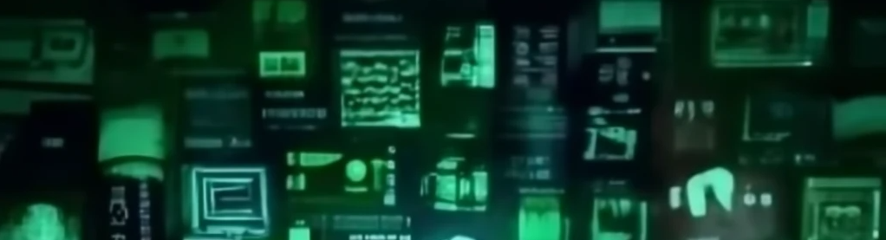
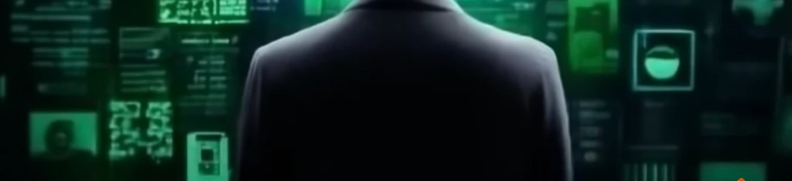

# Bienvenidos al Mundo Imaginado

CCBYSA M. Gea,  7 octubre, 2024

El titular que originalmente me había planteado para este blog era el clásico «Bienvenidos al mundo digital», pero probablemente estaría cayendo en esa visión ya caduca acerca del cambio, del mismo modo que si hubiera empezando diciendo «Bienvenidos al mundo de la televisión en color».

Seguramente cuando leas esto tendras tu espacio en Drive casi agotado, con más de una cuenta de correo que revisar todos los días, contestando a varios WhatsApp que son urgentes y dando a *me gusta* a un par de fotos en Instagram. Y aún así, esa visión de tu «espacio digital» también puede que sea algo desfasada porque centralizas tus contactos a través de Slack, planificas tu tiempo con Alexa e incluso puedes tener un resumen de este post con chatGPT.

Siempre que quiero introducir este «nuevo mundo» aprovecho una cita de Nicholas Negroponte de su libro «Being Digital» de 1995 que define perfectamente lo que representa este cambio:

> »La mejor manera de apreciar los méritos y las consecuencias de ser digital es reflexionar sobre la diferencia que existe entre bits y átomos» (N. Negroponte, 1995)

La figura de **Nicholas Negroponte** es importante, ya que en esa época tenia una posición privilegiada como fundador y director del [MIT Medialab](https://www.media.mit.edu/), un instituto de investigación heterogéneo y centro de referencia en innovaciones tecnológicas y epicentro del cambio digital.

La otra cita que suelo usar para entender lo que representa para el «ser humano» es la de **Pierre Lévy**, que en su discurso de «Cibercultura y la Educación» nos recuerda lo siguiente:

> «Por primera vez en la historia de la humanidad, la mayor parte de conocimientos adquiridos por una persona al inicio de su vida profesional, serán obsoletos al final de su carrera» (P. Lévy, 2000)

Para llegar a estas conclusiones, es fundamental desarrollar (e imaginar) los nuevos medios en los que se establecerá este proceso tal y como vaticinaba **Alan Kay**, diseñador destacado del MIT que estuvo implicado en el desarrollo del ordenador moderno y del concepto de tablet ([Dynabook](https://es.wikipedia.org/wiki/Dynabook))

> «La mejor forma de predecir el futuro es inventarlo» (A. Kay)

Sin duda, el impulso definitivo del cambio vino de la mano de **Tim Berners-Lee** cuando a principios de los años 90 establece los conceptos que darían pie al nacimiento de la Web. Este hito cambió para siempre la forma de manejar la tecnología y la conectividad entre personas. Se puede visitar la primera página que fue creada en https://info.cern.ch/. Una de sus frases más destacada es la siguiente:

> «La idea original de la web era que debería ser un espacio colaborativo donde poder comunicarse a través del intercambio de información. No se trata solo de conectar computadoras, se trata de conectar personas» (T. Berners-Lee)

Sin duda, es muy importante la infraestructura, pero también la capa software, y en ese contexto, **Mitchel Resnick** un destacado investigador y director del [MIT Kindergarten](https://www.media.mit.edu/groups/lifelong-kindergarten/overview/) propone como estrategia el aprender a programar para ese mundo cambiante. Para conseguirlo, nos plantea la *espiral de pensamiento creativo*, una metodología basada en la forma que los niños juegan como instrumento para expresar nuestra imaginación a través del software:

> «El éxito se basa no solamente en lo que sabes o en cuánto sabes, sino más bien en tu habilidad para pensar y actuar creativamente» (Resnick, 2008)

El software comienza a cobrar un valor muy importante, y la forma de gestionarlo empieza a ser crucial. La figura de **Richard Stallman** representa la cultura de compartir código con la intención que estuviese disponible de forma libre. Es pionero en 1985 la [FSF](https://www.fsf.org/es) (Free Software Foundation) con la filosofía de que cualquier producto creado bajo la Fundación pudiera ser utilizado, modificado y con la condición de difundir las modificaciones que se llegasen a hacer al programa. Es sin duda el impulsor del término *software libre,* y deja esa idea claramente en su manifiesto:

> «Si hay algo que merece una recompensa, es la contribución social. La creatividad puede ser una contribución social, pero solo en la medida en que la sociedad sea libre de aprovechar los resultados» (Stallman, 1985)

En esta línea nos encontramos con **Lawrence Lessig** como la figura que emerge en el contexto de la cultura libre y el conocimiento abierto y promotor de las licencias [Creative Commons](https://creativecommons.org/person/lessig/). Uno de sus planteamientos más conocido es la diferencia en el nivel de regulación (mediante leyes de copyright) de la cultura comercial (que protege a los creadores) frente a la no comercial o libre. Sin embargo, nos plantea un dilema y es que esa excesiva regulación puede estrangular la creatividad:

> «La expansión de Internet ha desencadenado una extraordinaria posibilidad de que muchos participen en este proceso de construir y cultivar esa cultura» (Lessig, 2005).

Este proceso no se queda aquí, sino que también altera los medios clásicos que hasta ahora conocíamos (tales como como la fotografía o el cine) y se convierten en *nuevos medios*. **Lev Manovich** nos brinda una forma de identificar estos cambios a través de mutaciones o hibridaciones a lo largo del tiempo. El ordenador se convierte en un metamedio que puede estar contenido en todo o parte de esos nuevos medios. Así, la fotografía, música o cine está simulado a través del metamedio y la capa de software que permite su transformación:

> «Bienvenidos al mundo del cambio permanente: el mundo que hoy por hoy no se define por pesadas maquinarias industriales, sino por el software que se encuentra en un flujo permanente. El software se ha convertido en nuestra interfaz con el mundo» (Manovich, 2013)

Los tiempos aquí y ahora ya no se miden como acostumbramos (con días, meses años), sino que la rapidez exponencial de las tecnologías y sus avances será tal, que en poco tiempo el conocimiento, la tecnología que la sustenta, las leyes que las protegen y hasta las personas, se vuelven obsoletas. Sólo hay que echar un vistazo a las teorías de crecimiento acelerado de **Ray Kurzweil** para comprender la rapidez de los cambios, vaticinando que llegaremos a la *singularidad tecnológica*:

> «La Singularidad es la futura etapa de la evolución humana, un momento en el que el ritmo del progreso tecnológico se tornará tan acelerado y sus efectos tan profundos que transformarán irreversiblemente nuestra existencia. A través de la tecnología, la humanidad logrará superar las restricciones que nuestra biología nos ha impuesto» (Ray Kurzweil, 1998)

El futuro es un tiempo impredecible, pero todas estas visiones nos ofrecen una perspectiva prometedora desde diferentes puntos de vista. Lo curioso de esta revisión es que son visiones basadas en la imaginación de investigadores y científicos que pertenecen a la posguerra y la época del baby boom. Estas visiones están impregnadas por el optimismo y la admiración por el (todavía lento) avance de la tecnología, la ciencia ficción y la llegada del hombre a la Luna.

Si nos adentramos en personas célebres de la generación X, podríamos pensar en personajes influyentes como **Mark Zuckemberg**, cabeza visible de Facebook y cuyo propósito es rediseñar el espacio de Internet bajo el concepto de Meta.

> «El metaverso no es algo que construya una empresa. Es el próximo capítulo de Internet en general»

En esta revisión faltarían muchas figuras que representen la visión de la generación X/Y/Z. ¿Cómo será tu mundo imaginado?

En este enlace a la [cronología](https://cdn.knightlab.com/libs/timeline3/latest/embed/index.html?source=1TeEmj6hGj_4uMD5j1SWnLLZOfORyZUIP&font=Default&lang=en&initial_zoom=2&height=650) podemos comprobar cómo han ido surgiendo esas ideas a lo largo del tiempo, quedando «huérfano» de figuras representativas las nuevas generaciones con su «nuevo mundo imaginado». Sin embargo, preguntad a cualquier niño en un colegio y…. te dirán que les gustarían ser influencer o Youtuber. ¿Será ese el camino que nos espera?

Bibliografía:

- Kurzweil, Raymond (1998) La era de las máquinas espirituales, Planeta
- Negroponte, Nicholas (1995) Being Digital, Knopf Doubleday Publishing
- Lessig, Lawrence (2005) Por una cultura libre, traficantes de sueños, 2005
- Lévy, Pierre (2000) CiberCultura y Educación. Pedagogía y Saberes, n14, 2000 https://revistas.upn.edu.co/index.php/PYS/article/view/6234/5687
- Manovich, Lev (2013). El software toma el mando. Barcelona: Editorial UOC
- Resnick, Mitchel. Cultivando las semillas para una sociedad más creativa, Revista Electrónica «Actualidades Investigativas en Educación», vol. 8, núm. 1, 2008. Recurso online: https://web.media.mit.edu/~mres/papers/sowing-seeds-spanish-translation.pdf
- Stallman, Richard. *Manifiesto GNU*, 1989. Disponible online: https://www.gnu.org/gnu/manifesto.es.html
- Imágenes realizadas con IA [craiyon](https://www.craiyon.com/)